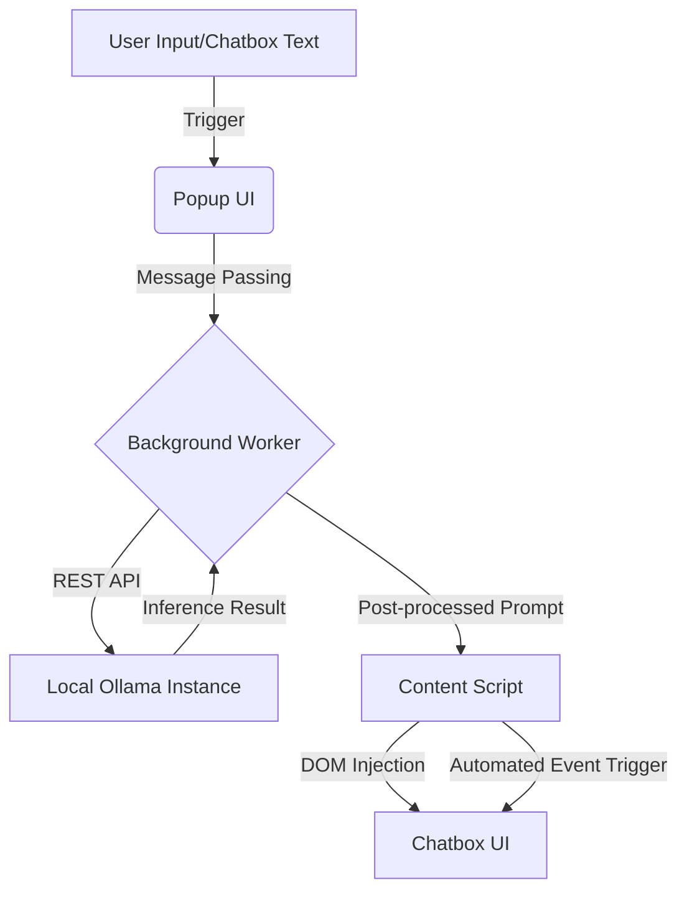

This `README.md` is designed for the **OmniPrompt Pro** architecture we’ve just finalized. It treats the extension not just as a script, but as a distributed system bridge between the browser's DOM and a local LLM inference engine.

---

# README.md

# OmniPrompt Pro

> **The bridge between browser-based LLM interfaces and local inference engines.**

OmniPrompt Pro is a high-performance Chrome extension engineered for researchers and developers. It automates prompt engineering by intercepting user intent, refining it through local Large Language Models (Ollama), and injecting structured "Mega-Prompts" back into web-based AI platforms (ChatGPT, Gemini, Perplexity) while bypassing Virtual DOM state locks.

## Table of Contents

1. [Architecture Overview](#architecture-overview)
2. [Technology Stack](#technology-stack)
3. [Prerequisites & System Requirements](#prerequisites--system-requirements)
4. [Installation & Setup](#installation--setup)
5. [Configuration](#configuration)
6. [Running the Application](#running-the-application)
7. [Testing](#testing)
8. [Continuous Integration & Delivery](#continuous-integration--delivery)
9. [Performance & Scaling](#performance--scaling-considerations)
10. [Security](#security)
11. [Contribution Guidelines](#contribution-guidelines)
12. [Roadmap](#roadmap)
13. [License](#license--acknowledgements)

---

## Architecture Overview

The system follows a **Decoupled Bridge Pattern**. It separates UI logic (Popup), Orchestration (Background Service Worker), and DOM Manipulation (Content Script).

### High-Level Data Flow




### Key Components

- **Popup UI:** State management for model selection, flavor profiles, and execution triggers.
- **Background Worker:** The orchestration layer. Handles `AbortController` signals for request cancellation and manages asynchronous fetch operations to the local API.
- **Deep Injector:** A specialized content script utilizing `document.execCommand` and Event Dispatches to synchronize text injection with React/Next.js state managers.

---

## Technology Stack

- **Runtime:** Chrome Extension Manifest V3 (Service Workers).
- **Inference Engine:** [Ollama](https://ollama.com/) (Local REST API).
- **Language:** Vanilla JavaScript (ES6+), HTML5, CSS3.
- **Communication:** Internal Chrome Message Passing (JSON-based).
- **Models Supported:** GPT-OSS (20B), Llama 3.1 (8B), Qwen 2.5 (7B), Phi-3 (3.8B).

---

## Prerequisites & System Requirements

- **OS:** macOS (Recommended for Unified Memory), Linux, or Windows.
- **Browser:** Google Chrome v94+ or Chromium-based browsers.
- **Hardware:** 16GB+ RAM (Unified Memory preferred for 20B models).
- **Global Tools:** * [Ollama CLI](https://ollama.com/download)
  - Git

---

## Installation & Setup

### 1. Local Model Setup

```bash
# Pull the recommended research suite
ollama pull gpt-oss:20b
ollama pull llama3.1:8b
ollama pull qwen2.5:7b
ollama pull phi3
```

### 2. Extension Installation

1. Clone the repository:
  ```bash
   git clone https://github.com/hakan/omniprompt-pro.git
  ```
2. Open Chrome and navigate to `chrome://extensions/`.
3. Enable **Developer Mode** (top right).
4. Click **Load unpacked** and select the root directory of this project.

### 3. Docker (Optional Ollama Hosting)

```bash
docker run -d -v ollama:/root/.ollama -p 11434:11434 --name ollama ollama/ollama
```

---

## Configuration

### Environment Variables (Ollama)

To allow the extension to communicate with the local server, set the CORS origins:

```bash
# For macOS
launchctl setenv OLLAMA_ORIGINS "chrome-extension://*"
```

### Internal Settings

Managed via `options.html`:

- `apiUrl`: Default `http://127.0.0.1:11434/api/generate`
- `modelName`: Default selection for inference.

---

## Running the Application

1. **Start Ollama:** Ensure the menu bar app or CLI is running.
2. **Navigate:** Open [ChatGPT](https://chatgpt.com) or [Gemini](https://gemini.google.com).
3. **Refine:** * Enter a basic idea in the OmniPrompt popup and click **Compile & Inject**.
  - Use **Revise Chatbox** to pull existing text for AI-powered optimization.
4. **Debug:** Use `F12` > `Console` on the target tab to view `injector.js` logs.

---

## Testing

The testing strategy focuses on **Message Integrity** and **DOM Resolution**.

- **Unit Tests:** Testing prompt-flavor template generation logic.
- **Integration Tests:** Verifying the background-to-content script bridge.
- **Manual E2E:** Verified across ChatGPT (React), Gemini (Angular/Custom), and Perplexity (ProseMirror).

```bash
# Run linter
npm run lint
```

---

## Performance & Scaling Considerations

- **Inference Latency:** 20B models (GPT-OSS) exhibit higher TTFT (Time to First Token). For real-time workflows, use **Phi-3** or **Llama 3.1 8B**.
- **Memory Footprint:** The background service worker stays idle until triggered, minimizing Chrome's memory overhead.
- **Context Optimization:** The system strips Markdown wrappers from AI responses before injection to reduce DOM reflow costs.

---

## Security

- **Zero-Cloud Inference:** All data processing remains local. No prompt data is sent to external servers (unless explicitly using GPT-4o cloud modes).
- **Secret Management:** API keys (if used) are stored in `chrome.storage.local` and never logged.
- **Sanitization:** The `Deep Injector` utilizes `insertText` which respects the browser's built-in XSS protections.

---

## Contribution Guidelines

1. **Branching:** Use `feature/` or `fix/` prefixes.
2. **Style:** Follow the provided `.eslintrc`.
3. **PRs:** Include a screenshot of the injection working on at least one AI platform.

---

## Roadmap

- **v2.6:** Batch comparison mode (Llama vs Qwen side-by-side).
- **v2.7:** Local history log (SQLite/IndexedDB).
- **v3.0:** Support for multimodal local models (Llava).

---

## License & Acknowledgements

- **License:** MIT License.
- **Credits:** Ollama Team for the local inference API;
- Hakan Mehmetcik (Marmara University) for the research framework.

